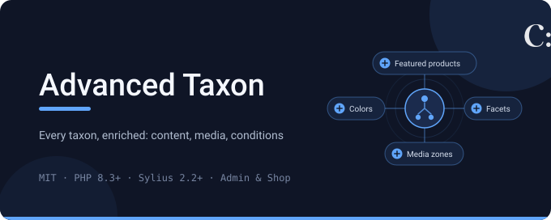
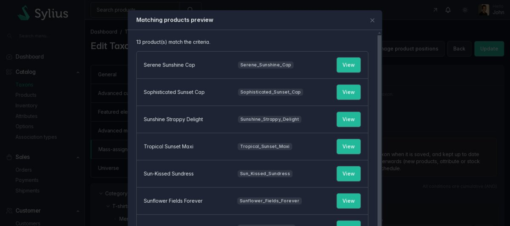

# Sylius Advanced Taxon Plugin

[](LICENSE)
[](https://packagist.org/packages/cyllene-digital/sylius-advanced-taxon-plugin)
[](https://github.com/CylleneDigital/SyliusAdvancedTaxonPlugin/actions/workflows/build.yaml)
[](https://github.com/CylleneDigital/SyliusAdvancedTaxonPlugin/actions/workflows/security.yaml)

Open-source [Sylius](https://sylius.com/) 2 plugin that turns taxons into editorial and
merchandising pages, configured per taxon from the back office:

- **branding**: color, icon or pictogram, shown in the menu, on the taxon page and in the breadcrumbs;
- **featured content**: featured child taxons and featured products, as a grid or a slider, before or
  after the filters;
- **media zones** around and inside the product list, with links, translated texts and placement modes;
- **universe pages**: a showcase layout (hero slider, introduction, children, featured products)
  instead of a product list;
- **advanced filters**: facets on attributes, options, sub-taxons and price, with their counts, on
  the native Sylius product grid, children products included on demand;
- **conditional taxons**: products assigned from conditions (attribute, option, name, description,
  stock, taxon membership), previewed in the back office and kept up to date;
- a **mega menu**, enabled per channel, and a drill-down mobile menu.

The complete list: [features](https://github.com/CylleneDigital/SyliusAdvancedTaxonPlugin/blob/main/docs/features.md).




## Compatibility

| Component | Versions |
|---|---|
| PHP | `^8.3` (Symfony 8: `^8.4`) |
| Sylius | `2.1`, `2.2`, `2.3` |
| Symfony | `^7.4`, or `^8.0` with Sylius 2.3 |
| Extensions and bundles | `ext-gd`, LiipImagineBundle, Symfony UX Autocomplete and UX Icons, Symfony Messenger, Sylius Twig Hooks |

## What this plugin does not do

- It never replaces a Sylius model: your `Taxon`, `Channel` and `TaxonImage` entities use the traits
  and interfaces it ships.
- Facets and conditions are SQL queries, not a search engine index; they read text and select
  attributes only.
- Conditional taxons are materialized, not dynamic: products that start matching later are attached
  when the conditions change or when the synchronization command runs, which the application
  schedules.
- The native taxon **Images** section of the back office is replaced by the plugin media zones, the
  main image included; taxon images of another type (your theme's) are kept but not editable there.

The full list: [what this plugin does not do](https://github.com/CylleneDigital/SyliusAdvancedTaxonPlugin/blob/main/docs/features.md#what-this-plugin-does-not-do).

## Installation

```bash
composer config extra.symfony.allow-contrib true
composer require cyllene-digital/sylius-advanced-taxon-plugin
```

The Flex recipe (`symfony/recipes-contrib`) registers the bundle, imports its configuration (Twig
hooks) and its admin route, and prints the remaining steps:

1. make your `Taxon`, `Channel` and `TaxonImage` entities use `AdvancedTaxonTrait`,
   `MegaMenuChannelTrait` and `AdvancedTaxonImageTrait` with their interfaces, and declare them as
   the Sylius models;
2. run the migration: `bin/console doctrine:migrations:migrate`;
3. import the plugin entrypoints from your `assets/admin/entrypoint.js` and
   `assets/shop/entrypoint.js`, then build your assets;
4. schedule `bin/console cyllene:advanced-taxon:sync-conditional-taxons`.

Without Flex, and for every detail (entity examples, Messenger routing, verification):
[installation guide](https://github.com/CylleneDigital/SyliusAdvancedTaxonPlugin/blob/main/docs/integration/installation.md).

## Configuration

Everything editorial is set per taxon in `Catalog > Taxons`, and the mega menu per channel. The
bundle configuration only adds icon libraries to the icon picker; the Tabler icons shipped by
Sylius are always available:

```yaml
# config/packages/cyllene_digital_sylius_advanced_taxon.yaml
cyllene_digital_sylius_advanced_taxon:
    icon_libraries:
        phosphor:
            label: 'Phosphor'
            icon_prefix: 'ph'
            icons: ['star', 'heart', 'tree-evergreen']
```

Liip Imagine filter sets, Messenger routing and the shop product grid:
[configuration reference](https://github.com/CylleneDigital/SyliusAdvancedTaxonPlugin/blob/main/docs/integration/configuration.md).

## In production

- **Taxon pages list products through the Sylius shop product grid.** Children products and advanced
  filters are added to the native grid query: pagination, sorting, search and channel restriction
  behave as in a standard Sylius shop.
- **Route the synchronization message on a large catalog.** Saving a taxon whose conditions changed
  dispatches `CylleneDigital\SyliusAdvancedTaxonPlugin\Message\SynchronizeConditionalTaxon`, handled
  synchronously unless routed to an asynchronous transport.
- **Schedule the synchronization command.** It is what attaches products that start matching after
  the last change of conditions (new products, attribute or stock changes).
- **Pictograms and media are Sylius images**: stored by the Sylius image uploader (local, S3...) and
  served through Liip Imagine.
- **Icons are local**: the plugin templates only use Tabler icons, shipped by Sylius or by the plugin.
  Import with `bin/console ux:icons:import` the icons of your `icon_libraries` that merchants pick,
  so that they do not depend on Iconify at render time.

## Troubleshooting

Nothing from the plugin shows up, the pages are unstyled, children products or filters are missing,
or the synchronization does not run: see
[troubleshooting](https://github.com/CylleneDigital/SyliusAdvancedTaxonPlugin/blob/main/docs/integration/troubleshooting.md).

## Upgrading

Upgrade the Composer package, run the migrations and rebuild your assets, then read
[UPGRADE.md](UPGRADE.md). If your theme overrides a plugin template or one of the Sylius hooks the
plugin replaces, compare it with the new version.

## Public contract

The entity traits and interfaces, the Twig hooks and functions, the bundle configuration, the
message, the command, the admin route and the database schema only change in a major version. The
full list and the support policy:
[public contract](https://github.com/CylleneDigital/SyliusAdvancedTaxonPlugin/blob/main/docs/architecture/public-contract.md).

## Documentation

- [Back-office guide](https://github.com/CylleneDigital/SyliusAdvancedTaxonPlugin/blob/main/docs/admin/user-guide.md): for merchants
- [Theming and Twig hooks](https://github.com/CylleneDigital/SyliusAdvancedTaxonPlugin/blob/main/docs/integration/theming.md): for integrators
- [Technical documentation](https://github.com/CylleneDigital/SyliusAdvancedTaxonPlugin/blob/main/docs/README.md): every page, by audience

## Status

**Tested** by 198 PHPUnit tests (units; integration tests on a real database for every condition
type and operator, the facets, the grid pagination and the synchronization; functional tests of the
back office) and 47 Behat scenarios, 5 of them in headless Chrome (icon picker, media rows,
conditions preview, save and refusal). Both suites pass on Sylius 2.1, 2.2 and 2.3; the PHPUnit suite
also on PostgreSQL 17.

The continuous integration matrix covers Sylius 2.1, 2.2 and 2.3, PHP 8.3, 8.4 and 8.5, Symfony 7.4
and 8, on MySQL 8.0 and 8.4, MariaDB 10.11 and 11.4, and PostgreSQL 15 to 17, every Behat scenario
included.

One limit comes from Sylius: with DBAL 4, its own migrations are skipped on a database declared as
MariaDB ([details](https://github.com/CylleneDigital/SyliusAdvancedTaxonPlugin/blob/main/docs/persistence/migrations.md)).

## Contributing

[CONTRIBUTING.md](CONTRIBUTING.md): environment, checks run by the CI and conventions.

A security flaw is reported privately: [SECURITY.md](SECURITY.md). Do not open it as a public issue.

## Provenance and licence

The plugin is released under the **MIT** licence (see [LICENSE](LICENSE)). The icons in
`assets/icons/` come from [Tabler Icons](https://tabler.io/icons) (MIT, see `assets/icons/LICENSE`).

---

Package: [`cyllene-digital/sylius-advanced-taxon-plugin`](https://packagist.org/packages/cyllene-digital/sylius-advanced-taxon-plugin)

Maintained by [Cyllene](https://www.groupe-cyllene.com/), on GitHub as [@CylleneDigital](https://github.com/CylleneDigital)
