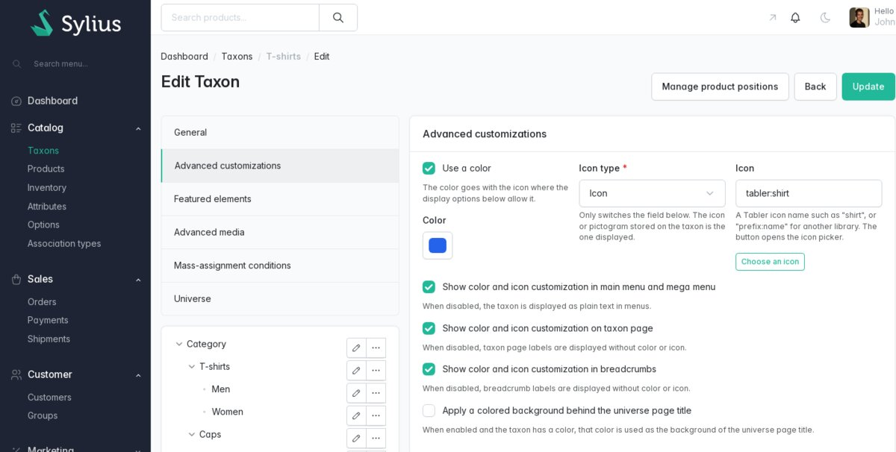
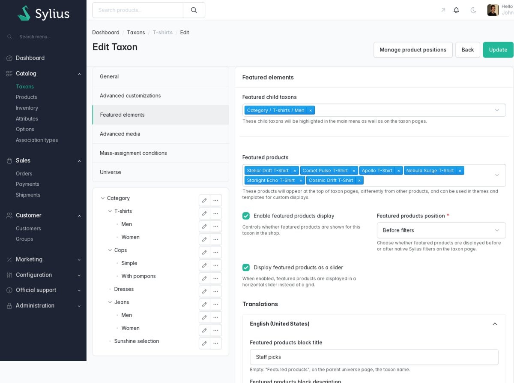
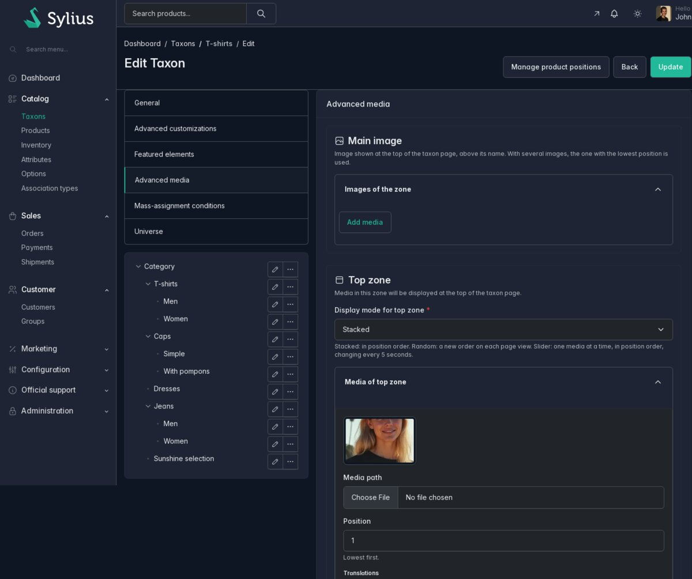
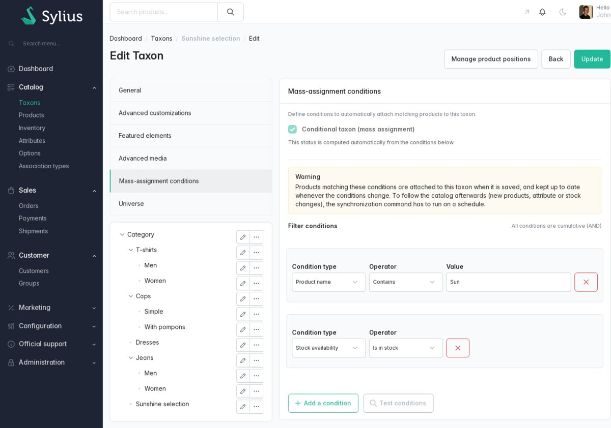
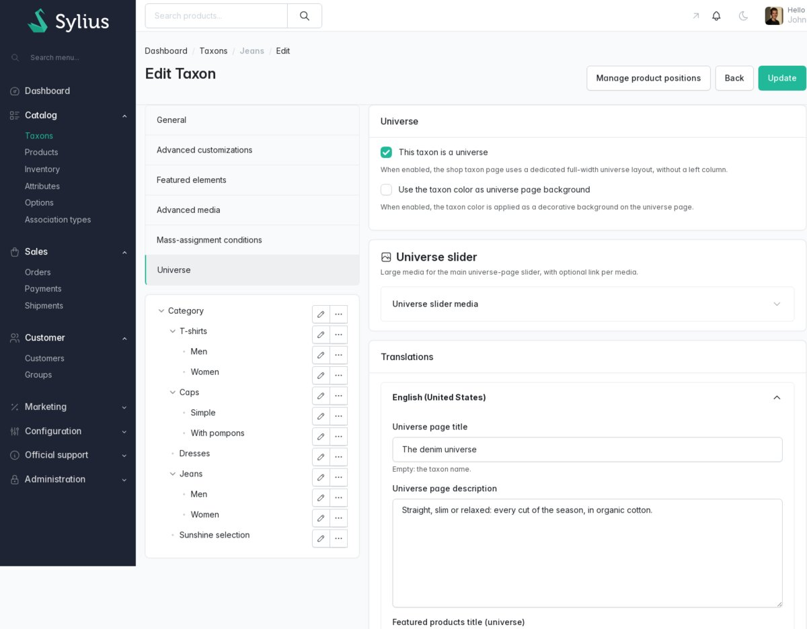

# Back-office guide

For merchants and content editors. The plugin settings live in two screens:

- **Catalog > Taxons**, create or edit a taxon: every setting is stored on the taxon and applies to
  every channel;
- **Configuration > Channels**, create or edit a channel: the mega menu switch.

Labels below are the English ones shown in the back office. For what the customer sees, see
[storefront](../shop/storefront.md); for the full feature list, see [features](../features.md).

## Taxon form

The taxon form is split into six tabs, listed in the left column above the taxon tree:

1. **General**
2. **Advanced customizations**
3. **Featured elements**
4. **Advanced media**
5. **Mass-assignment conditions**
6. **Universe**

The tab list and the tree scroll together, so both stay visible on long forms. All tabs are saved
at once by the form buttons. When the form is refused, the tabs holding an error are shown in red with a
"!", the first of them opens, and the folded zones holding an error unfold. The native Sylius **Images** section is not shown: the main taxon image
is edited in the [Main image](#advanced-media) zone.

Fields whose behavior is not obvious carry a one-line help text under them; this guide details every
field.

Some fields need the taxon to exist: create it first, then edit it to pick featured products or
featured children.

### General

| Field | Default | Effect in the shop |
| --- | --- | --- |
| **Code**, **Parent**, **Enabled** | native | native Sylius behavior |
| **Enable advanced filters in the shop** | off | the taxon page shows an **All filters** button and replaces the child taxon links of the left column with filters ([advanced filters](../shop/storefront.md#advanced-filters)) |
| **Include products from child taxons** | off | the product list (and the filter counts) also include products assigned to the descendant taxons |

The **Translations** card holds the native name, slug and description per locale.

### Advanced customizations

| Field | Default | Effect in the shop |
| --- | --- | --- |
| **Use a color** | off (on for a taxon that has a color) | when off, the taxon has no color: the **Color** value is not saved |
| **Color** | empty | color of the taxon name and glyph; background of the mega menu featured column; color of the child taxon cards; universe page colors. Only saved when **Use a color** is checked |
| **Icon type** | **Icon** | **Icon** shows the **Icon** field and the icon picker; **Picture** shows the **Pictogram file** field. It only switches the form fields: what is displayed depends on the stored icon |
| **Icon** | empty | a glyph shown before the taxon name |
| **Pictogram file** | empty | an uploaded image shown before the taxon name instead of a glyph |
| **Show color and icon customization in main menu and mega menu** | on | when off, the taxon is plain text in the menus |
| **Show color and icon customization on taxon page** | on | when off, the taxon page title has no color or icon |
| **Show color and icon customization in breadcrumbs** | on | when off, the breadcrumb item has no color or icon |
| **Apply a colored background behind the universe page title** | off | universe pages only: the intro card gets the taxon color as background, when the taxon has a color |

**Color**: a color picker always sends a value (`#000000` when untouched), so checking **Use a
color** is what gives the taxon a color; unchecking it removes the color.

**Icon**: type a glyph name, or click **Choose an icon** next to the field to open the icon picker
and click an icon. The picker lists the Tabler icons shipped with Sylius plus the icon libraries declared
by your integrator ([configuration](../integration/configuration.md)). A name without prefix
(`shirt`) is read as a Tabler icon (`tabler:shirt`). A name the shop cannot display (an icon missing
from its icon libraries) is refused when saving.

**Pictogram file**: choose **Picture** as **Icon type**, then upload a PNG, JPEG, WebP or GIF image
of 2 MB at most. SVG is refused. The file is stored when the whole form is valid, in the same storage
as the other Sylius images; the current pictogram is shown under the field. It is displayed at most
160 x 160 pixels, scaled to the label size. Uploading another one, choosing a glyph afterwards, or
deleting the taxon deletes the stored pictogram once the taxon is saved.

### Featured elements

| Field | Default | Effect in the shop |
| --- | --- | --- |
| **Featured child taxons** | none | listed first in the menus, shown in the mega menu **Featured categories** column and as a card block on the taxon page |
| **Featured products** | none | the products of the featured products block |
| **Enable featured products display** | off | shows the featured products block on the taxon page |
| **Featured products position** | **Before filters** | **Before filters** or **After filters**: above or below the native search, sorting and filter controls |
| **Display featured products as a slider** | off | horizontal slider instead of a grid |

Constraints:

- **Featured child taxons** is disabled while the taxon has no child (always on creation); the
  choices are its direct children. They are shown in their order in the taxon tree.
- **Featured products** is disabled until the taxon is created; the choices are the products
  assigned to this taxon (not to its children). Type to search.
- In the shop, a featured product is only shown when it is enabled and available in the current
  channel, and a featured child only when it is enabled. A product later removed from the taxon
  stays featured: remove it from **Featured products** too.

**Translations**, one block per locale:

| Field | Used for | When empty |
| --- | --- | --- |
| **Featured products block title** | title of the featured products block; title of this taxon's slider on its parent universe page | "Featured products"; on a universe page, the taxon name |
| **Featured products block description** | text under that title | a generic default text; nothing on a universe page |
| **Featured taxons block title** | title of the featured children block of the taxon page | "Featured categories" |
| **Featured taxons block description** | text under that title | a generic default text |

The mega menu column title is always "Featured categories".

### Advanced media

Six zones, each with a title, a help text and a collapsible media list; all but the main image have
a display mode. The universe slider is configured in the [Universe](#universe) tab.

| Zone | Display mode field | Choices (default first) | Where it shows |
| --- | --- | --- | --- |
| **Main image** | none | none | taxon page header, above the name: the media with the lowest position |
| **Top zone** | **Display mode for top zone** | **Stacked**, **Random**, **Slider** | full width, above the product list and the left column |
| **Bottom zone** | **Display mode for bottom zone** | **Stacked**, **Random**, **Slider** | under the pagination; at the bottom of a universe page |
| **Left zone** | **Display mode for left column** | **Stacked**, **Random** | left column, under the filters or the child taxon links |
| **Display as product card** | **Insertion position in product listing** | **Insert at the end of the product list**, **Insert at the beginning of the product list**, **Insert randomly in the middle of the product list** | as cards inside the product list |
| **Spotlight zone** | **Display mode for spotlight media** | **Stacked**, **Random** | one image: mega menu image when hovering this taxon, image of this taxon's card on the taxon page and the universe page |

- **Stacked**: media in position order. **Random**: a new random order on each page view.
  **Slider** (top and bottom zones): one media at a time, in position order, changing every 5
  seconds, with previous / next buttons. For the
  spotlight zone, **Stacked** shows the media with the lowest position and **Random** one media
  picked at random.
- **Main image** replaces the native Sylius **Images** section: a taxon image saved by Sylius
  without type is listed there, and gets the `main` type when the taxon is saved.
- Product cards are inserted once: on the first page for **beginning** and **random middle**, on the
  last page for **end**. In random mode each media gets its own random place.
- The top, bottom, left and product card zones are not displayed on universe pages, except the
  bottom zone.

#### Media fields

Open the zone list, click **Add media**, fill the media, save the taxon. **Remove** removes the media when
the taxon is saved, and Sylius erases its file from the image storage.

| Field | Notes |
| --- | --- |
| **URL** | link of the media, offered in the **Display as product card** zone and the **Universe slider** only, the two rendering links. Accepted: `https://...`, `http://...` or a shop path starting with `/`; any other value is silently dropped |
| **Media path** | the image file. An existing media shows a thumbnail; a media without file is not displayed |
| **Position** | display order inside the zone, lowest first. A new media is pre-filled with the highest position of the zone plus one (1 for an empty zone) |
| **Show title and description in the card** | product card zone only, on by default. When off, the card shows the image only, in the grid and in the list view |
| **Translations**: **Title**, **Description** | per locale, used by the top, bottom, left, product card and universe slider zones: the title as image and card title, the description as alt text and card text. When empty, the taxon name is used. The main image and the spotlight zone do not use them |

#### Image processing

Media files follow the Sylius taxon image rules (an image, 10 MB at most, JPEG, PNG, GIF or WebP by
default). Before storage, an image wider or taller than 1600 pixels, or heavier than 2 MB, is
re-encoded in its own format, downscaled to fit 1600 x 1600 pixels when larger (transparency kept,
JPEG and WebP at quality 82). An image too large for the server memory is stored as is.

### Mass-assignment conditions

A conditional taxon gets its products automatically from conditions. See
[conditional taxons](../domain/conditional-taxons.md) for the full rules.

- **Conditional taxon (mass assignment)**: read-only, checked as soon as there is a condition.
- The warning box explains that matching products are attached when the taxon is saved and kept up
  to date whenever the conditions change. Following the catalog afterwards (new products,
  attribute or stock changes) needs the synchronization command to run on a schedule, set up by your
  integrator ([installation](../integration/installation.md#6-keep-conditional-taxons-in-sync)).

**Filter conditions** (all conditions are cumulative, AND). Click **Add a condition**, then fill
the row:

| Condition type | **Reference (attr / opt / etc.)** | **Operator** | **Value** |
| --- | --- | --- | --- |
| **Product attribute** | a text or select attribute | **Equals**, **Not equal to**, **Contains**, **Does not contain** | text compared with text attribute values and with select attribute choices |
| **Product option** | an option | **In**, **Not in** | an option value as named in one of the shop languages (case ignored) |
| **Product name** | hidden | **Contains**, **Does not contain**, **Equals**, **Not equal to** | text |
| **Product description** | hidden | **Contains**, **Does not contain** | text |
| **Stock availability** | hidden | **Is in stock** | hidden |
| **Taxon membership** | a taxon | **In**, **Not in** | hidden |

- The reference list shows names in the admin language; a name shared by several entries carries
  its code. Only text and select attributes are listed.
- The reference must exist. A condition whose attribute, option or taxon is deleted later is never
  applied: the taxon then matches no product (see
  [conditional taxons](../domain/conditional-taxons.md#fail-closed)).
- Only the operators of the selected type are offered.
- Negative operators exclude every product that owns a matching value (for instance any variant with
  that option value).
- **Is in stock**: at least one enabled variant not tracked, or with stock left after reservations.
- **Taxon membership** matches products assigned to that exact taxon.
- The cross button removes a row.

On save:

- products matching every condition are attached to the taxon; products that stop matching are
  detached, including products assigned by hand;
- products that stay keep their position;
- removing every condition detaches every product of the taxon;
- renaming or moving the taxon does not resynchronize it;
- disabled products keep their assignment.

#### Testing conditions

**Test conditions** opens **Matching products preview** with the conditions as currently typed,
without saving:

- "*N* product(s) match the criteria.", then up to 20 products with their name, code and a **View**
  button opening the product in a new tab, and "… and *N* more product(s)." beyond 20;
- incomplete rows are ignored; with no complete row, the count is 0 and "No products found." is
  shown;
- the preview counts the same products as the save: disabled products included, names and
  descriptions read in the default locale;
- "Unable to calculate the preview at the moment." means the request failed (for instance an
  expired session).

### Universe

| Field | Default | Effect in the shop |
| --- | --- | --- |
| **This taxon is a universe** | off | the taxon page becomes a full-width universe page without product list, left column, filters or pagination ([universe page](../shop/storefront.md#universe-page)) |
| **Use the taxon color as universe page background** | off | the page background becomes a gradient from the taxon color to white, when the taxon has a color |

**Universe slider**: large media for the hero slider of the universe page, with the same
[media fields](#media-fields) as the other zones (no display mode, no card text option). The **URL**
makes the slide clickable.

**Translations**, one block per locale:

| Field | Used for | When empty |
| --- | --- | --- |
| **Universe page title** | title of the universe page | the taxon name |
| **Universe page description** | text under the title | nothing |
| **Featured products title (universe)** | title above the featured products sliders of the child taxons, shown when at least one child displays featured products | nothing |
| **Featured products description (universe)** | text under that title | nothing |

A child gets a slider when its **Enable featured products display** is on and it has featured
products visible in the shop; the slider is used whatever its **Display featured products as a
slider** setting. The title and description of each child slider come from that child's **Featured
products block title** and **Featured products block description**.

A universe lists no products, so it cannot be the main taxon of a product (see
[validation messages](#validation-messages)).

## Channel form

In the **Look & feel** section of a channel:

- **Enable mega menu** (off by default): the main shop menu of this channel is displayed as a mega
  menu with level 2 and level 3 taxons in columns, and the mobile burger opens a drill-down menu
  ([mega menu](../shop/storefront.md#mega-menu)).

## Validation messages

Errors are shown with the field concerned; the taxon is not saved until they are fixed.

| Where | Message |
| --- | --- |
| Condition type | This condition type is not supported. |
| Operator | This operator cannot be used with this condition type. |
| Reference | Select the attribute, option or taxon this condition applies to. |
| Reference | The attribute, option or taxon "*code*" does not exist, or cannot be used in a condition. |
| Reference | A taxon cannot be the reference of its own condition. |
| Value | Enter the value this condition compares to. |
| Reference or value | This value is too long: 255 characters at most. |
| **Icon** | The icon "*name*" cannot be found in the icon libraries of the shop. |
| **Pictogram file** | The pictogram must be a PNG, JPEG, WebP or GIF image of 2 MB at most. |
| Product form, main taxon | The universe "*name*" cannot be the main taxon of a product: a universe page does not list products. |

Media files show the native Sylius image messages.

Some values are not rejected with a message but discarded when saved:

| Field | Kept | Otherwise |
| --- | --- | --- |
| **Color** | `#rrggbb`, when **Use a color** is checked | emptied |
| **Icon** | a glyph name (letters, digits, `-`, `_`, `:`) or the reference of an uploaded pictogram | emptied |
| Media **URL** | `http://`, `https://` or a path starting with a single `/` | emptied |

The **Icon** field cannot point to an image: a pictogram can only come from an upload.
