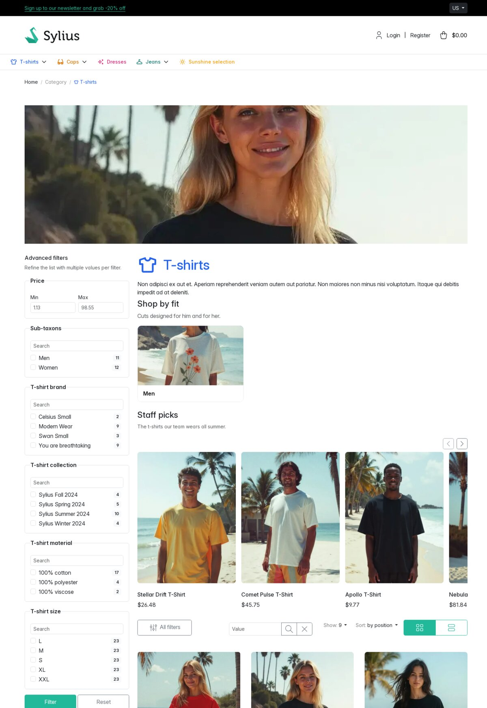
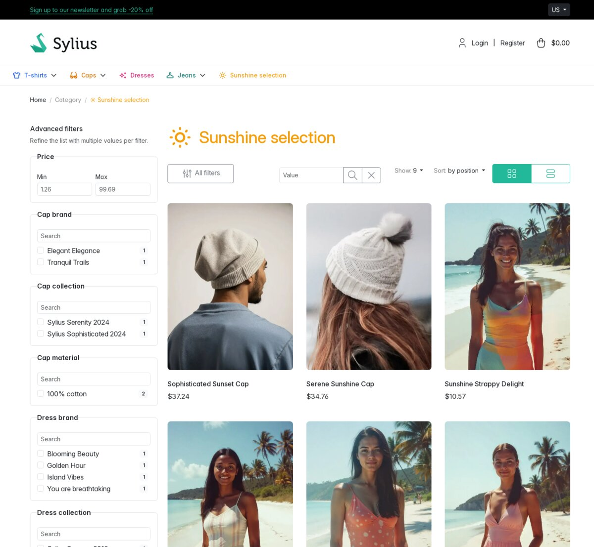
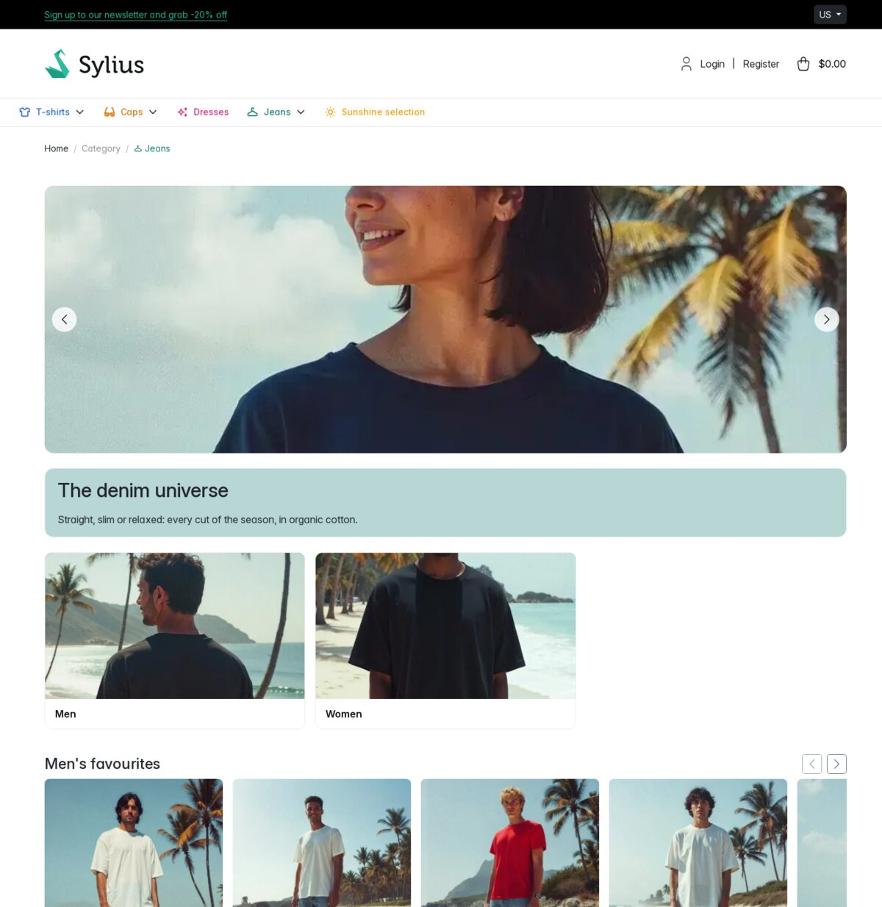
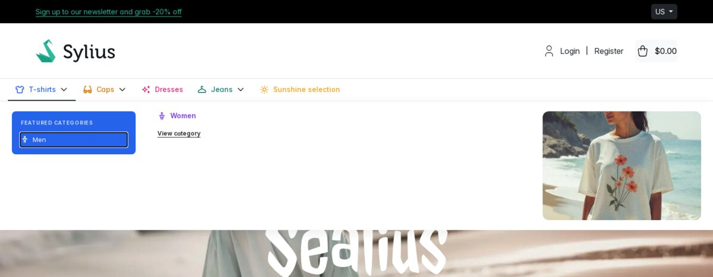
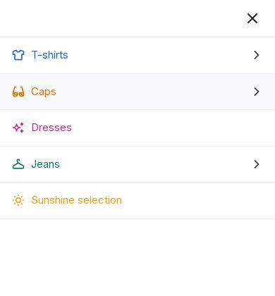

# Storefront

What a customer sees on a taxon page, on a universe page and in the menus. Settings are described in
the [back-office guide](../admin/user-guide.md); template and hook names in the
[public contract](../architecture/public-contract.md) and [theming](../integration/theming.md).

## Taxon page layout



From top to bottom (desktop):

| Area | Content | Shown when |
| --- | --- | --- |
| Breadcrumbs | Home, ancestors, current taxon | always |
| Top media | **Top zone** media, full width | the zone has media |
| Left column | advanced filters or child taxon links, then **Left zone** media | always on a standard taxon |
| Main column, header | main taxon image, taxon name, taxon description (native), featured child taxons | each part when it has content |
| Main column | featured products, if positioned **Before filters** | enabled and not empty |
| Main column | **All filters** button, native search, limit, sorting, grid / list switch | always |
| Main column | featured products, if positioned **After filters** | enabled and not empty |
| Main column | product list, with product card media | always |
| Main column | native pagination, then **Bottom zone** media | always / the zone has media |

Below 992 pixels the left column comes after the main column, and the advanced filters become a
drawer. A [universe](#universe-page) taxon uses another layout.

## Breadcrumbs

Home, then each ancestor, then the current taxon. The root taxon and disabled ancestors are plain
text; the others are links. Each item is a [taxon label](#taxon-labels) with a 14-pixel icon, unless
**Show color and icon customization in breadcrumbs** is off for that taxon.

## Header

- **Main image**: the taxon image of type `main` (or empty, as Sylius stores it) with the lowest
  position, through the `sylius_shop_taxon_thumbnail` filter. Set in the **Main image** zone of the
  taxon form.
- **Featured child taxons**: see [below](#featured-child-taxons).
- **Taxon name**: `h1` with a 60-pixel icon and the taxon color, unless **Show color and icon
  customization on taxon page** is off.
- **Description**: native Sylius.

## Featured child taxons

A block placed after the taxon name and description, when the taxon has enabled featured
children (a disabled featured child, or one moved under another parent since it was picked, is not
shown):

- title: **Featured taxons block title**, or "Featured categories";
- description: **Featured taxons block description**, or a default text;
- one card per featured child: name (with a chevron when the child has
  children), spotlight image or an empty placeholder, the child color as accent. Hovering or focusing
  the name slides up a panel with the child, its enabled children and **View category**.

## Featured products

Shown when **Enable featured products display** is on and at least one selected product is visible,
before or after the filter controls depending on **Featured products position**. A featured product
is visible when it is enabled and available in the current channel; the others are left out. Not
shown on universe pages.

- Title: **Featured products block title**, or "Featured products"; description: **Featured
  products block description**, or a default text.
- Grid: native Sylius product cards.
- Slider (**Display featured products as a slider**): a horizontal row of product cards. From 768
  pixels, previous / next buttons scroll by one card and are disabled at each end. Below, the row is
  swiped and a hint reads "Swipe horizontally to discover more products". No autoplay.

## Product listing

The list is the native Sylius shop product grid of the taxon: same pagination, sorting, search,
limit and channel restriction. The plugin adds:

- products of the descendant taxons when **Include products from child taxons** is on (or when the
  application sets the Sylius `include_all_descendants` grid option);
- the advanced filters, when enabled on the taxon;
- product card media.

An empty list shows "There are no results to display".

### Grid and list views

Two buttons after the sorting control switch the view; the choice is kept in the `view` URL
parameter, along with the other parameters:

- **Grid** (default, any `view` value other than `list`): native Sylius product cards;
- **List** (`view=list`): one row per product with image, name, short description (first 180
  characters, without HTML), price of the first enabled variant (or "Unavailable") and a **View**
  button.

### Media cards in the listing

The **Display as product card** media are mixed with the products:

| Insertion position | Placement | Page |
| --- | --- | --- |
| **Insert at the beginning of the product list** | before the products, by position | first page |
| **Insert at the end of the product list** | after the products, by position | last page |
| **Insert randomly in the middle of the product list** | each media at a random place between the first and the last product, recomputed on every view | first page |

With a single product on the page, random media go after it. No card is added to an empty list.

- Grid view: a card with the image; with **Show title and description in the card**, the title
  (or the taxon name) and the description (first 140 characters). With a valid **URL**, the whole
  card is a link.
- List view: a row with the image; with **Show title and description in the card**, the title
  and the description (first 180 characters). The image is a link when the media has a valid
  **URL**.

## Media zones

| Zone | Placement | Order |
| --- | --- | --- |
| **Top zone** | full width, above both columns, on every page of the list | display mode |
| **Left zone** | left column, under the filters or child links | display mode |
| **Bottom zone** | under the pagination; at the bottom of a universe page | display mode |
| **Display as product card** | [in the listing](#media-cards-in-the-listing) | position |
| **Spotlight zone** | mega menu hover image, child taxon cards | one media |
| **Universe slider** | [hero slider](#hero-slider) of a universe page | position |

**Stacked** lists the media by position; **Random** shuffles them on every view. Top, left and bottom
media are full-width images, lazy loaded, with the media title as `title` and the description as
`alt` (the taxon name when empty). They are not links. **Slider** (top and bottom zones, from two
media) shows one media at a time in position order, with the markup of the [hero slider](#hero-slider)
of a universe page: it changes every 5 seconds, pauses on hover, has previous / next buttons, and
serves the lighter `cyllene_universe_slider_mobile` image below 768 pixels.

## Sidebar

- With advanced filters enabled: the [filter panel](#advanced-filters).
- Otherwise: links to the enabled child taxons, and **Go level up** to the parent when the parent is
  enabled and is not the root.
- Then the **Left zone** media.

## Advanced filters



Enabled per taxon. The panel is a form in the left column:

- heading "Advanced filters" and "Refine the list with multiple values per filter.";
- **Price**: **Min** and **Max** fields, with the lowest and highest price of the listed products as
  placeholders. Prices are the channel prices of the enabled variants in the current channel; min and
  max are swapped if inverted;
- **Sub-taxons**: enabled descendant taxons holding listed products;
- one block per product attribute with text or select values (select values show their translated
  label);
- one block per product option, with the option values in the current language;
- **Filter** submits, **Reset** reloads the page without any parameter.

Each value is a checkbox with its product count. Counts use the same products as the list (current
channel, enabled products, children option, native search) with the other selected filters applied;
the counts of a facet ignore its own selection. Values are sorted by label, facets by name; a facet
or a value without product is not shown.

- Several values in one facet: products matching any of them. Several facets: products matching all.
- An option filter and a price filter apply to the same variant: "size M" and "from 40" keeps
  products having one variant that is both.
- Every facet block but the price has a search field ("Search") that hides the values not matching what is typed,
  ignoring case and accents, and shows "No matching value" when nothing matches. It is not submitted;
  a checked value stays checked when hidden. Long lists scroll after 150 pixels.
- Submitting keeps `view`, `limit`, `sorting` and the native search, and goes back to the first page.
  The other way round, the native search and its clear button keep the selected filters, `view`,
  `limit` and `sorting`.

**All filters** (in the filter controls bar):

- from 992 pixels: hides or shows the panel; when hidden, the whole left column (left media
  included) disappears and the list takes the full width. The panel is open on page load;
- below 992 pixels: the panel is a drawer sliding from the left, over a dark backdrop. It closes with
  its close button, a click on the backdrop or the Escape key.

## Universe page



A taxon with **This taxon is a universe** shows a full-width page. Breadcrumbs stay; there is no
left column, header, featured products block, filter controls, product list, pagination, top, left or
product card media. With **Use the taxon color as universe page background** and a taxon color, the
page sits on a gradient from that color to white.

In order:

1. [Hero slider](#hero-slider).
2. **Intro card**: **Universe page title** (or the taxon name) as `h1`, and **Universe page
   description**. With **Apply a colored background behind the universe page title** and a taxon
   color, the card takes that color.
3. **Child taxon cards**: one per enabled child, featured children first, same card as the
   [featured child taxons](#featured-child-taxons). Without enabled child, the page shows "There
   are no results to display" instead of the cards and sliders.
4. **Featured products of the children**, when at least one child displays featured products, that
   is a child with **Enable featured products display** on and at least one featured product
   enabled and available in the current channel:
   - **Featured products title (universe)** and **Featured products description (universe)** in a
     card, when filled;
   - for each such child, in the card order: a slider of its visible featured products, titled by
     the child **Featured products block title** (or its name) and **Featured products block
     description**, then a **View category** button in the universe taxon color (blue when it has
     none). It is always a slider: the child **Display featured products as a slider** setting is not
     used here.

   When no child displays featured products, the section is left out.
5. **Bottom zone** media.

### Hero slider

Built from the **Universe slider** media, by position:

- one slide at a time; previous / next buttons ("Previous slide" / "Next slide" for screen
  readers) appear with two slides or more;
- autoplay every 5 seconds, looping, paused while the pointer is over the slider; no swipe gesture;
- a slide with a valid **URL** is a link (the URL is checked again on display, as on product
  cards);
- below 768 pixels, a lighter image is served (`cyllene_universe_slider_mobile` filter, 640 x 360
  cropped, or the original when the filter set is missing);
- alt text: description, else title, else the taxon name.

## Navigation menu

The menu lists the children of the channel menu taxon, as in Sylius. In every mode, the enabled
children of a taxon are listed with its featured children first, then the others in the tree order.

### Standard menu

Used when **Enable mega menu** is off on the channel:

- level 1 taxons as links, or as dropdowns when they have children;
- nested dropdowns at any depth (a chevron marks a taxon with children);
- every item is a [taxon label](#taxon-labels) (20 pixels at level 1, 18 below), unless **Show
  color and icon customization in main menu and mega menu** is off for that taxon;
- below 992 pixels, the burger opens the menu in an off-canvas panel, as in Sylius.

### Mega menu



Used from 992 pixels when **Enable mega menu** is on. Hovering (or focusing) a level 1 taxon with
children opens a full-width panel:

- **Featured categories** column: the featured children of the level 1 taxon, white text, on the
  level 1 taxon color when its menu customization is on;
- one column per other level 2 child: its name (a taxon label), up to five level 3 children (featured
  first), then **View category**;
- an image area: hovering a featured link or a column shows the spotlight image of that level 2
  taxon, and clears it when leaving.

Level 1 items are taxon labels with a chevron when they have children. The bar scrolls horizontally
when it is wider than the screen.

### Mobile menu



In mega menu mode, below 992 pixels, the burger opens a drawer instead of the native off-canvas:

- first screen: level 1 taxons; a taxon with children opens its own screen, the others are links;
- level 1 and level 2 screens: **Back**, a close button, the taxon name with **View all products**,
  then its children (all of them, featured first);
- first screen: level 1 names with their color and icon, as in the desktop menu (when **Show color
  and icon customization in main menu and mega menu** is on); deeper screens: plain names;
- the drawer closes with the close button, a click outside the panel or the Escape key, and goes
  back to the first screen once closed.

## Taxon labels

The name of a taxon with its customization, used by the menus, the breadcrumbs and the taxon page
title:

- color: applied to the name and to the glyph (without color, the glyph takes the color of the text around it);
- glyph: an icon from the configured libraries, sized for the context;
- pictogram: the uploaded image, sized for the context (served by the `cyllene_advanced_taxon_icon`
  filter, 160 x 160 at most);
- each context has its own toggle; when off, only the name is shown.

## URL parameters

| Parameter | Owner | Effect |
| --- | --- | --- |
| `view` | plugin | `list` shows the list view; anything else the grid |
| `advanced[price][min]`, `advanced[price][max]` | plugin | price range, in currency units |
| `advanced[taxons][]` | plugin | descendant taxon ids |
| `advanced[attributes][<code>][]` | plugin | attribute values (text, or choice key for select attributes) |
| `advanced[options][<code>][]` | plugin | option values, as named in the current language |
| `criteria[search][value]` | Sylius | native product name search (`LIKE` on the name in the current locale: case-sensitive on PostgreSQL); also restricts the filter counts, with the same semantics |
| `sorting[...]` | Sylius | native sorting |
| `limit` | Sylius | native page size |
| `page` | Sylius | native pagination |

`advanced[...]` is ignored on a taxon without advanced filters. Example:

```text
/en_US/taxons/t-shirts?view=list&advanced[options][t_shirt_size][]=M&advanced[price][max]=40&sorting[price]=asc
```

## What stays native Sylius

- The product grid: pagination, sorting, page size, search, channel and enabled-product restriction,
  product cards.
- Breadcrumb structure and the taxon description. The main image is chosen by the plugin (type `main`
  or empty, lowest position) and rendered with the native filter and markup.
- The product page and the rest of the shop.
- The standard menu structure, when the mega menu is off.
